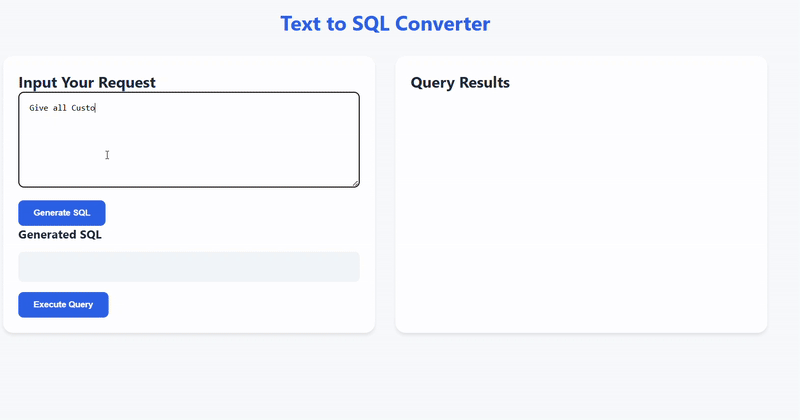

# Part_1_Agent
This Folder Contains the Solution To Implement the Text-to-SQL Conversion System:

# Part_2_Agent
This folder Contains the solution for Part 2: Additional Features

# To Run The Project Part 1
1) Install the packages from  requirements.txt
2) Start FastAPI Server - uvicorn main:app

# To Run The Project Part 2
1) Visit The Google Collab Link
### Google Collab Link

https://colab.research.google.com/drive/128sBCKkm0L2nvtPbiV83cBh4KSXTlI9s?usp=sharing

Here's a quick demo of the application:

